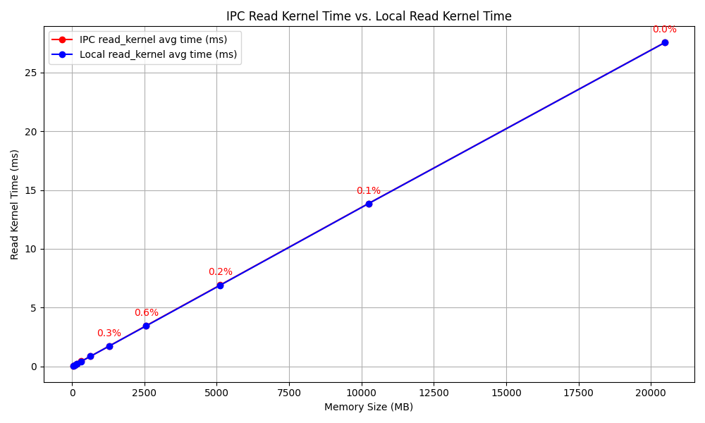
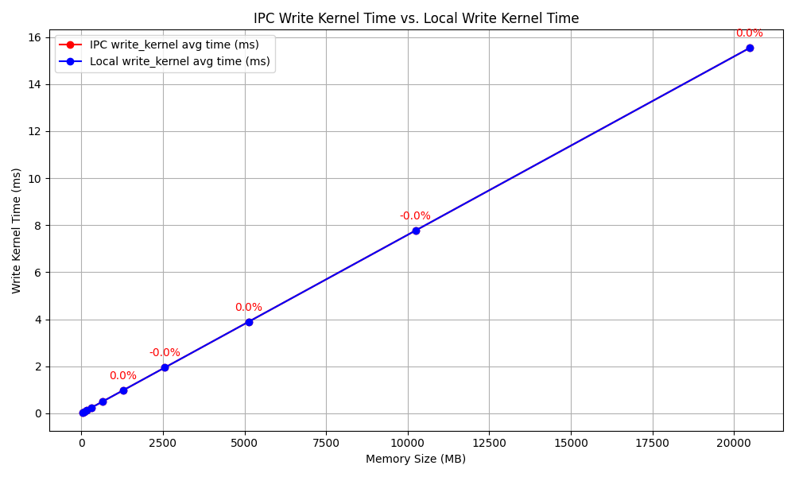

# CUDA IPC Summary

### (1) Performance Overhead  
- **Question**:  
  Does cuda ipc add any memory or latency overhead when two processes are sharing the same chunk?
- **Observation**:  
  Accessing memory via `cudaIpcOpenMemHandle` (IPC) shows **negligible performance difference** compared to local memory allocated with `cudaMalloc`.  
- **Implication**:  
  IPC-based memory sharing introduces minimal latency for cross-process GPU memory access.



---

### (2) Data Coherency & Synchronization  
- **Question**:  
  Is the memory coherent between two processes? What happen when one writes and the other read, what semantics does it have?
- **Observation**:  
  Server-side modifications to shared memory are **not be immediately visible** to the client during polling without explicit synchronization (`__threadfence`).  
- **Implement**:  
  Server modifies the memory while the client is polling using `polling_kernel`.

---

### (3) Virtual Memory Management(VMM) and IPC Compatibility  
- **Question**:  
  Does ipc work with virtual memory?
- **Observation**:
  - Legacy CUDA IPC APIs (`cudaIpc*`) **are incompatible** with the new Virtual Memory Management (VMM) system.  
  - **Required Approach**:  
    - Use `cuMemExportToShareableHandle` and `cuMemImportFromShareableHandle` for VMM-compatible IPC.  
    - Transfer file descriptors via **Unix-domain sockets**.  
- **Reference**:  
  [NVIDIA Blog: Introducing Low-Level GPU Virtual Memory Management](https://developer.nvidia.com/blog/introducing-low-level-gpu-virtual-memory-management/)

---

### (4) Fault Tolerance  
- **Question**:  
  How does ipc shared memory deal with crashes from anyone has access to that memory including host?
- **Observation**:  
  Shared IPC memory remains accessible to the client even if the server process crashes, and the same conclusion holds true in reverse.
- **Reason**:  
  IPC memory ownership is managed by the CUDA driver, not strictly tied to the server's process lifetime.  


## Build and Run Script Example
```bash
# Compile and run the CUDA IPC latency test example
nvcc -o cuda_ipc_latency_test cuda_ipc_latency_test.cu
./cuda_ipc_latency_test server

# For Task 3, link against the CUDA runtime library explicitly
nvcc -o server server.cu -lcuda
nvcc -o client client.cu -lcuda
```